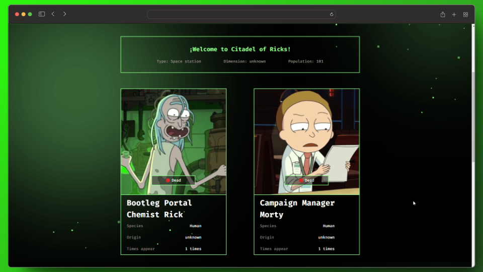

# Rick and Morty Web App

## Description

This is a web application that utilizes the "Rick and Morty" API to display information about locations and residents from the animated series universe.

## Key Features

- Search for "Rick and Morty" universe locations, with error notification for invalid inputs.
- View detailed information about locations and their residents.
- Dynamic pagination to display residents per page.
- Loader for an improved user experience when loading resident cards.

## Technologies Used

- React.js
- JavaScript (ES6+)
- HTML/CSS

## Installation

1. Clone the repository: `git clone https://github.com/yourusername/rick-and-morty-app.git`
2. Navigate to the project directory: `cd rick-and-morty-app`
3. Install dependencies: `npm install`
4. Start the application: `npm start`

## Usage

Once the application is running, you can perform the following actions:

- Search for specific locations using the search field, with error notifications for invalid inputs.
- Explore details of locations and residents.
- Navigate between resident pages to view more characters.

## Contributions

Contributions are welcome! If you encounter any issues or have any improvements, please open an issue or submit a pull request.

## Credits

This project uses the "Rick and Morty" API: [The Rick and Morty API](https://rickandmortyapi.com/).

## Project Status

The project is under development, and more functionalities are being added. Feel free to explore and share your feedback.

## Author

Jesús Aguilar

# --- Español

## Descripción

Esta es una aplicación web que utiliza la API de "Rick and Morty" para mostrar información sobre ubicaciones y residentes del universo de la serie animada.

## Funcionalidades Principales

- Búsqueda de ubicaciones del universo de "Rick and Morty", con notificación de error para entradas no válidas.
- Visualización de información detallada sobre ubicaciones y sus residentes.
- Paginación dinámica para mostrar los residentes por página.
- Loader para mejorar la experiencia del usuario al cargar las tarjetas de residentes.

## Tecnologías Utilizadas

- React.js
- JavaScript (ES6+)
- HTML/CSS

## Instalación

1. Clona el repositorio: `git clone https://github.com/tuusuario/rick-and-morty-app.git`
2. Ingresa al directorio del proyecto: `cd rick-and-morty-app`
3. Instala las dependencias: `npm install`
4. Inicia la aplicación: `npm start`

## Uso

Una vez iniciada la aplicación, puedes realizar las siguientes acciones:

- Buscar ubicaciones específicas utilizando el campo de búsqueda, con notificaciones de error para entradas no válidas.
- Explorar detalles de ubicaciones y residentes.
- Navegar entre las páginas de residentes para ver más personajes.

## Contribuciones

¡Las contribuciones son bienvenidas! Si encuentras algún problema o tienes alguna mejora, por favor abre un issue o envía un pull request.

## Créditos

Este proyecto utiliza la API de "Rick and Morty": [The Rick and Morty API](https://rickandmortyapi.com/).

## Estado del Proyecto

El proyecto se encuentra en desarrollo y se están agregando más funcionalidades. Siéntete libre de explorar y compartir tus comentarios.